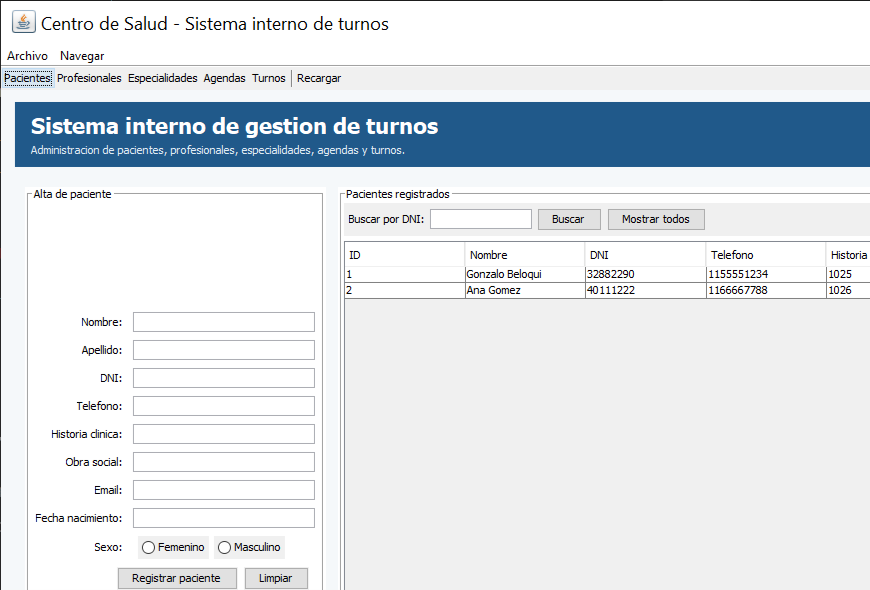
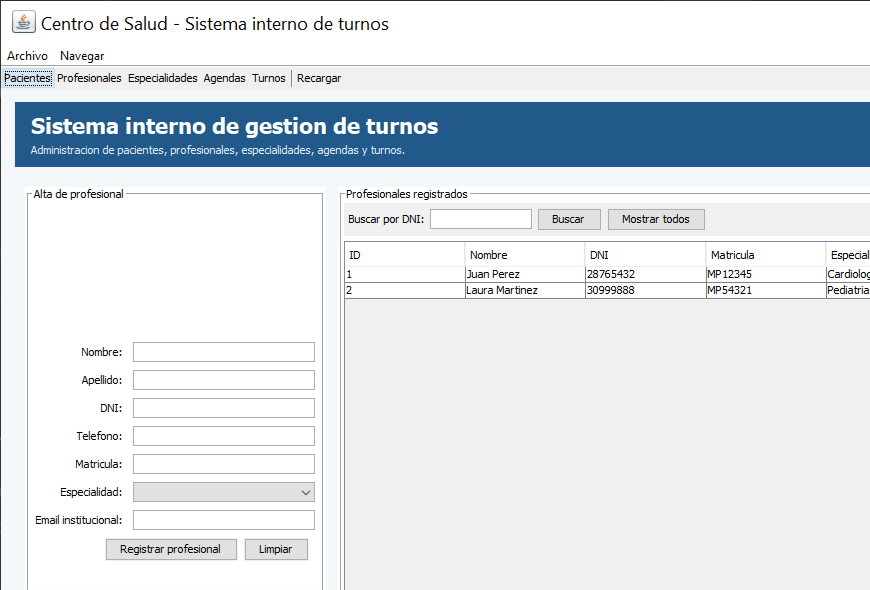
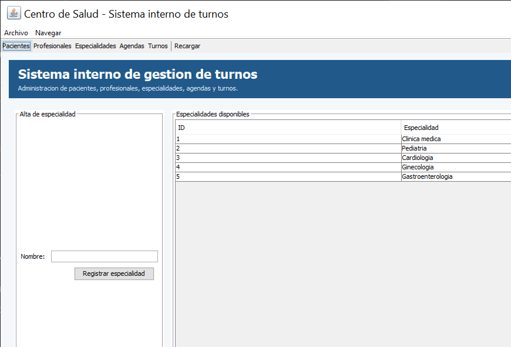
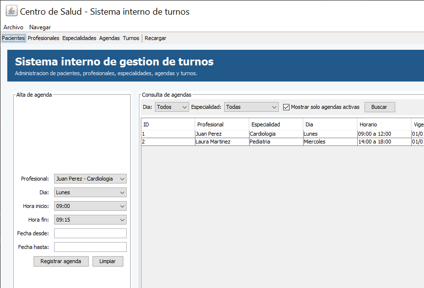
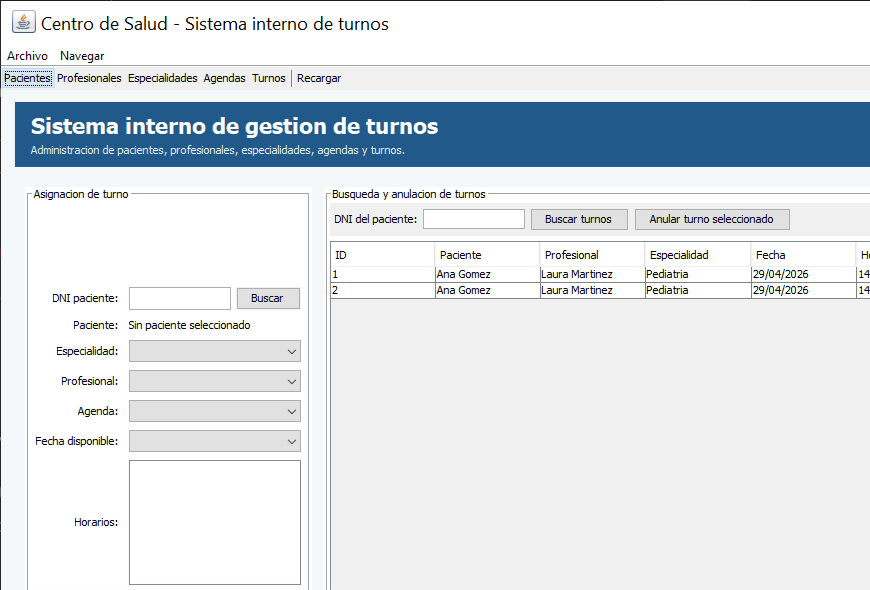

**Carrera:** Tecnicatura Universitaria en Programacion

**Asignatura:** Programacion II

**Nombre del/a docente:** Mario Daniel Detke

**Nombre del/a estudiante:** Gonzalo Ezequiel Beloqui

**Fecha de entrega:** 2026/06/09


## Actividad Numero 4 - Interfaz grafica

### Introducción

En esta actividad se amplió el sistema de turnos médicos incorporando una interfaz gráfica desarrollada con Java Swing. El objetivo fue reemplazar la interacción a través consola por una pantalla destinada a empleados administrativos del centro de salud, manteniendo las funcionalidades principales ya implementadas en el proyecto: carga de pacientes, carga de profesionales, carga de especialidades, creación de agendas, búsqueda de información, asignación y anulación de turnos. La interfaz no esta pensada para que el paciente gestione directamente sus turnos, sino para que un usuario empleado opere el sistema.

### Clases incorporadas

+ [PrincipalApp](../01_Proyecto/beloqui_gonzalo/00_principal/PrincipalApp.java)

La clase PrincipalApp se ubica dentro del paquete `com.beloqui.main`, contiene el metodo `main` y construye la ventana principal del sistema mediante un `JFrame`.

Sus responsabilidades principales son:

```
- Crear la ventana principal del sistema.
- Construir una interfaz por secciones navegables desde la barra superior.
- Incorporar formularios para cada operacion del sistema.
- Mostrar los datos persistidos en tablas.
- Capturar eventos de botones y menus.
- Mostrar mensajes de exito o error mediante `JOptionPane`.
- Delegar la logica de negocio en el controlador del sistema.
```

+ [SistemaTurnos](../01_Proyecto/beloqui_gonzalo/02_controlador/SistemaTurnos.java)

La clase SistemaTurnos se incorporo dentro del paquete `com.beloqui.controlador` para separar la logica de negocio de la interfaz grafica. Su funcion en esta actividad es actuar como puente entre los formularios Swing y las clases ya existentes del proyecto. De esta manera, `PrincipalApp` queda orientada a la vista y no concentra directamente la lectura de archivos ni las operaciones del sistema.

+ [OperacionInvalidaException](../01_Proyecto/beloqui_gonzalo/02_controlador/OperacionInvalidaException.java)

Se agrego una excepcion personalizada para comunicar a la interfaz las operaciones que no pueden completarse. De esta forma, `PrincipalApp` puede mostrar el mensaje correspondiente mediante cuadros de dialogo sin mezclar la logica visual con la logica del sistema.

### Planificacion de la interfaz grafica

La interfaz fue planificada como un sistema interno de gestion. Por ese motivo se eligio una ventana principal con cinco secciones, de modo que cada funcionalidad quede agrupada de forma clara para el empleado.

Las pantallas definidas son:

```
- Pacientes
- Profesionales
- Especialidades
- Agendas
- Turnos
```

Esta organizacion permite que el usuario administrativo pueda navegar entre operaciones sin utilizar la terminal y sin modificar archivos manualmente.

La ventana principal contiene:

- Barra de menu con opciones de archivo y navegacion.
- Barra de herramientas con accesos directos a las secciones principales.
- Encabezado institucional del sistema.
- Panel central que cambia su contenido segun la seccion seleccionada.
- Barra inferior de estado para informar el resultado de las acciones.

### Administradores de diseno utilizados

Para cumplir con los lineamientos de la Unidad 4 se utilizaron contenedores Swing y distintos administradores de diseno.

**JFrame**

Se utiliza como ventana principal de la aplicacion. Contiene la barra de menu, la barra de herramientas, el encabezado, el panel central de contenido y la barra de estado.

**JPanel**

Se utiliza para organizar cada sector visual de la ventana: encabezado, formularios, listados, filtros, botones y pie de estado.

**BorderLayout**

Se utiliza para distribuir las zonas generales de la ventana:

```
- Norte: barra de herramientas y encabezado.
- Centro: panel de contenido de la seccion seleccionada.
- Sur: barra de estado.
```

**GridBagLayout**

Se utiliza en los formularios de carga de datos, porque permite alinear etiquetas y campos en filas, manteniendo una estructura ordenada.

**BoxLayout**

Se utiliza en el encabezado para organizar titulo y subtitulo en forma vertical.

**FlowLayout**

Se utiliza en sectores simples como filtros, botoneras y grupos de acciones.

### Componentes Swing incorporados

La interfaz utiliza los componentes solicitados por la consigna y otros componentes complementarios:

```
- JFrame
- JPanel
- JLabel
- JTextField
- JButton
- JMenu
- JMenuBar
- JMenuItem
- JToolBar
- JTable
- JComboBox
- JRadioButton
- JCheckBox
- JList
- JScrollPane
- JOptionPane
```

Los componentes se utilizan de forma integrada para permitir altas, busquedas, consultas y anulaciones desde una interfaz grafica.

### Manejo de eventos

El manejo de eventos se implemento mediante `ActionListener` asociado a botones, opciones de menu y accesos de la barra de herramientas.

Algunos eventos implementados son:

```
- Registrar paciente.
- Buscar paciente por DNI.
- Registrar profesional.
- Buscar profesional por DNI.
- Registrar especialidad.
- Registrar agenda.
- Buscar agendas por dia y especialidad.
- Buscar paciente por DNI para asignar turno.
- Cargar especialidades habilitadas segun edad, sexo y turnos vigentes.
- Cargar profesionales y agendas disponibles segun la especialidad seleccionada.
- Consultar fechas y horarios disponibles.
- Asignar turno.
- Buscar turnos por paciente.
- Anular turno seleccionado.
- Recargar datos desde archivos.
- Cambiar de seccion desde menu o barra de herramientas.
```

Tambien se agregaron accesos rapidos de teclado para navegar entre pantallas:

```
- Ctrl + 1: Pacientes
- Ctrl + 2: Profesionales
- Ctrl + 3: Especialidades
- Ctrl + 4: Agendas
- Ctrl + 5: Turnos
```

### Dialogos y mensajes

La interfaz utiliza `JOptionPane` para mostrar confirmaciones, errores y mensajes de operaciones completadas. Las reglas de carga, busqueda, asignacion y anulacion ya fueron definidas en actividades anteriores; en esta actividad se adapto su comunicacion para que el usuario empleado reciba respuestas visuales en lugar de mensajes por consola.

### Pantalla Pacientes

La pantalla Pacientes permite registrar nuevos pacientes y buscar pacientes existentes por DNI. El formulario incluye nombre, apellido, DNI, telefono, historia clinica, obra social, email, fecha de nacimiento y sexo.



### Pantalla Profesionales

La pantalla Profesionales permite registrar medicos o profesionales de salud. Incluye nombre, apellido, DNI, telefono, matricula, especialidad y email institucional.



### Pantalla Especialidades

La pantalla Especialidades permite cargar nuevas especialidades y consultar las especialidades ya disponibles en el sistema.



### Pantalla Agendas

La pantalla Agendas permite crear agendas de atencion para cada profesional, indicando dia de la semana, hora de inicio, hora de fin y fechas de vigencia. Tambien permite consultar agendas filtrando por dia y especialidad.



### Pantalla Turnos

La pantalla Turnos esta orientada al trabajo del empleado administrativo. Primero se busca al paciente por DNI. A partir de ese paciente, el sistema carga solamente las especialidades habilitadas segun sus restricciones de edad y sexo, y tambien evita ofrecer una especialidad si el paciente ya posee un turno vigente para ella. Luego se selecciona el profesional de la especialidad elegida, una agenda activa, una fecha disponible y finalmente un horario libre para confirmar la reserva.

La misma pantalla incluye una busqueda por DNI de paciente para visualizar turnos registrados y anular el turno seleccionado cuando corresponda.



### Recarga de datos

La barra superior incluye el boton `Recargar`, que vuelve a leer los datos persistidos por los gestores existentes y actualiza tablas y listas desplegables. Esta accion se incorporo como recurso de interfaz para refrescar la informacion visible sin cerrar la aplicacion.

### Ejecucion del programa

Para ejecutar la interfaz desde PowerShell se debe ingresar a la raiz del repositorio y compilar los archivos Java:

```powershell
cd C:\Users\Administrador\Documents\UCES_PROGRAMACION_II

$fuentes = Get-ChildItem -Recurse -Filter *.java .\01_Proyecto\beloqui_gonzalo |
    Select-Object -ExpandProperty FullName

javac -encoding UTF-8 -d .\01_Proyecto\beloqui_gonzalo\out $fuentes

java -cp .\01_Proyecto\beloqui_gonzalo\out com.beloqui.main.PrincipalApp
```

Es importante ejecutar el programa desde la carpeta `UCES_PROGRAMACION_II`, porque los archivos de datos se leen con rutas relativas a esa ubicacion.

### Conclusion

La actividad permitio ampliar el sistema de turnos medicos con una interfaz grafica interna para empleados. La nueva implementacion facilita el uso del sistema, evita depender de la consola y organiza las operaciones principales en secciones separadas. Ademas, mantiene la estructura del proyecto, respeta el paquete solicitado para `PrincipalApp.java`, reutiliza los modelos y gestores existentes, y aplica los contenidos de la Unidad 4 mediante Swing, contenedores, administradores de diseno, manejo de eventos y manejo de excepciones.
