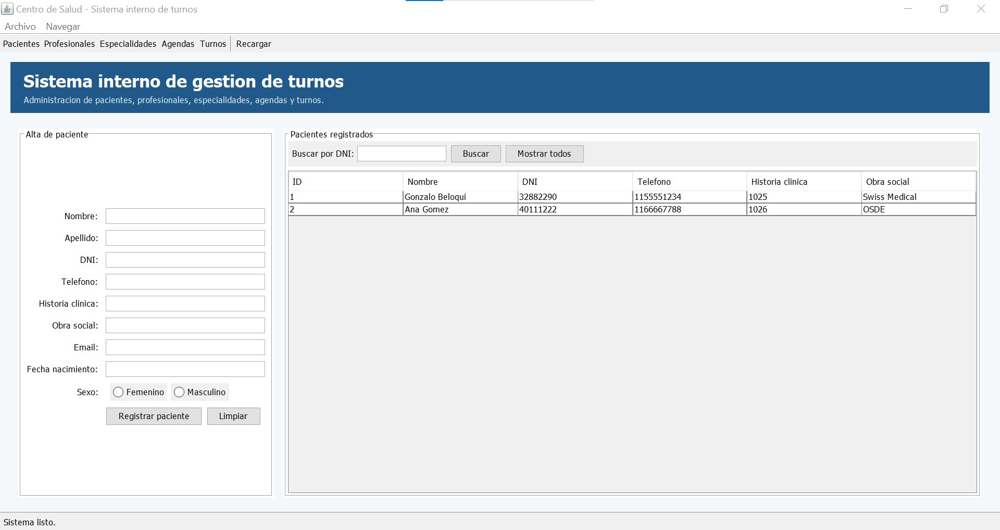
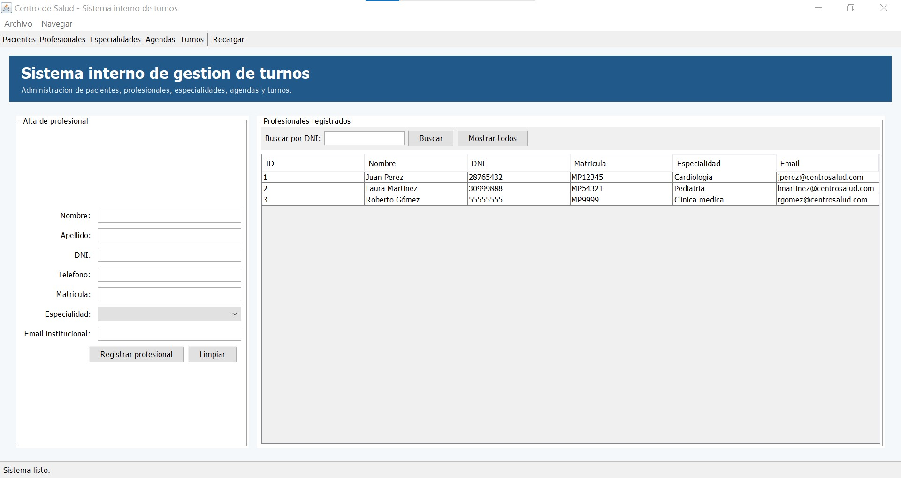
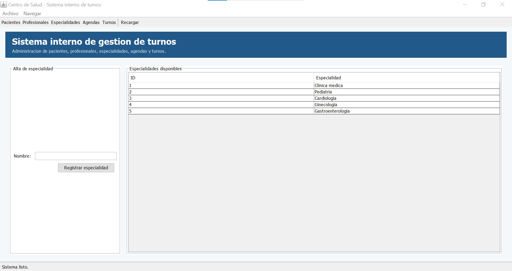
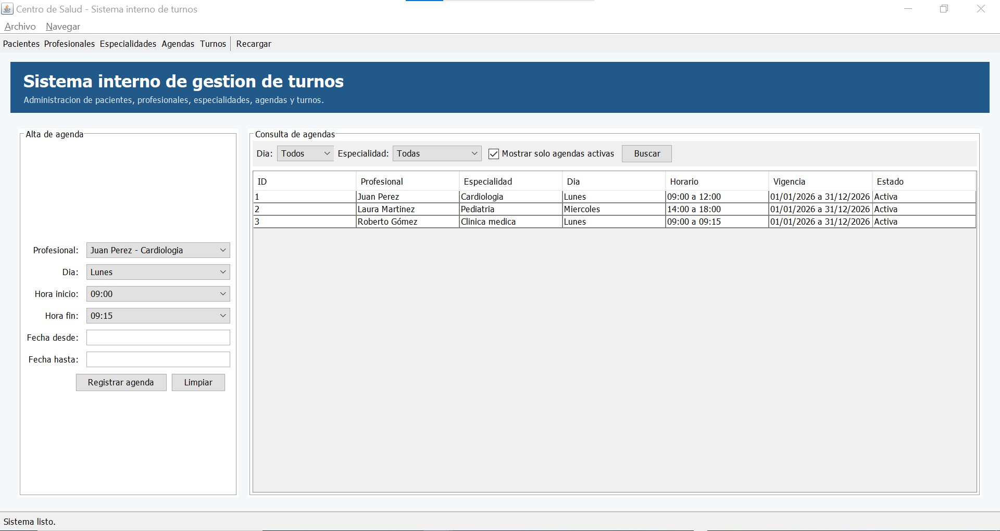
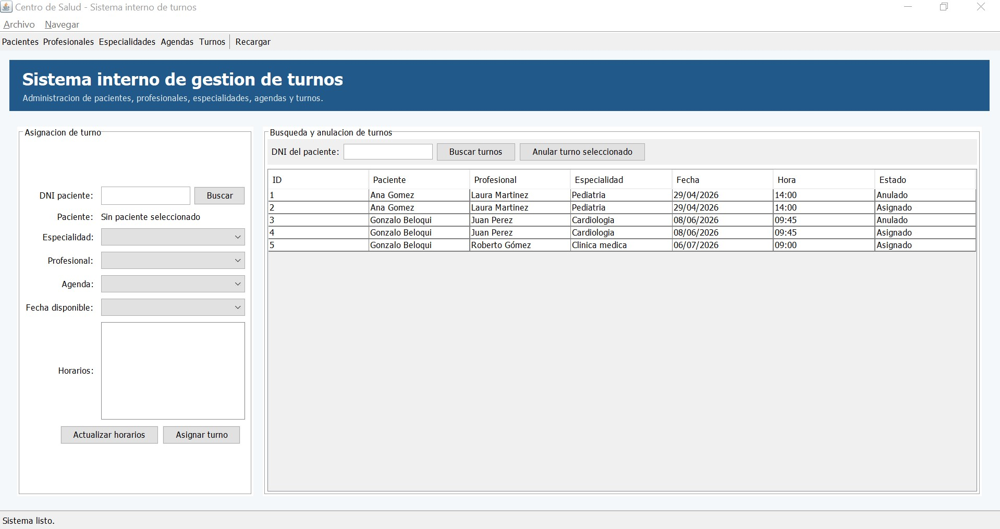

**Carrera:** Tecnicatura Universitaria en Programación

**Asignatura:** Programación II

**Nombre del/a docente:** Mario Daniel Detke

**Nombre del/a estudiante:** Gonzalo Ezequiel Beloqui

**Fecha de entrega:** 2026/06/09


## Actividad Número 4 - Interfaz gráfica

### Introducción

En esta actividad se amplió el sistema de turnos médicos incorporando una interfaz gráfica desarrollada con Java Swing. El objetivo fue reemplazar la interacción a través consola por una pantalla destinada a empleados administrativos del centro de salud, manteniendo las funcionalidades principales ya implementadas en el proyecto: carga de pacientes, carga de profesionales, carga de especialidades, creación de agendas, búsqueda de información, asignación y anulación de turnos. La interfaz no está pensada para que el paciente gestione directamente sus turnos, sino para que un usuario empleado opere el sistema.

### Clases incorporadas

+ [PrincipalApp](../01_Proyecto/beloqui_gonzalo/00_principal/PrincipalApp.java)

La clase PrincipalApp se ubica dentro del paquete `com.beloqui.main`, contiene el método `main` y construye la ventana principal del sistema mediante un `JFrame`.

Sus responsabilidades principales son:

```
- Crear la ventana principal del sistema.
- Construir una interfaz por secciones navegables desde la barra superior.
- Incorporar formularios para cada operación del sistema.
- Mostrar los datos persistidos en tablas.
- Capturar eventos de botones y menús.
- Mostrar mensajes de éxito o error mediante `JOptionPane`.
- Delegar la lógica de negocio en el controlador del sistema.
```

+ [SistemaTurnos](../01_Proyecto/beloqui_gonzalo/02_controlador/SistemaTurnos.java)

La clase SistemaTurnos se incorporó dentro del paquete `controlador` para separar la lógica de negocio de la interfaz gráfica. Su función en esta actividad es actuar como puente entre los formularios Swing y las clases ya existentes del proyecto. De esta manera, `PrincipalApp` queda orientada a la vista y no concentra directamente la lectura de archivos ni las operaciones del sistema.

+ [OperacionInvalidaException](../01_Proyecto/beloqui_gonzalo/02_controlador/OperacionInvalidaException.java)

Se agregó una excepción personalizada para comunicar a la interfaz las operaciones que no pueden completarse. De esta forma, `PrincipalApp` puede mostrar el mensaje correspondiente mediante cuadros de diálogo sin mezclar la lógica visual con la lógica del sistema.

### Planificación de la interfaz gráfica

La interfaz fue planificada como un sistema interno de gestión. Por ese motivo se eligió una ventana principal con cinco secciones, de modo que cada funcionalidad quede agrupada de forma clara para el empleado.

Las pantallas definidas son:

```
- Pacientes
- Profesionales
- Especialidades
- Agendas
- Turnos
```

Esta organización permite que el usuario administrativo pueda navegar entre operaciones sin utilizar la terminal y sin modificar archivos manualmente.

La ventana principal contiene:

```
- Barra de menú con opciones de archivo y navegación.
- Barra de herramientas con accesos directos a las secciones principales.
- Encabezado institucional del sistema.
- Panel central que cambia su contenido según la sección seleccionada.
- Barra inferior de estado para informar el resultado de las acciones.
```

### Administradores de diseno utilizados

Se utilizaron contenedores Swing y distintos administradores de diseño:

**JFrame**

Se utiliza como ventana principal de la aplicación. Contiene la barra de menú, la barra de herramientas, el encabezado, el panel central de contenido y la barra de estado.

**JPanel**

Se utiliza para organizar cada sector visual de la ventana: encabezado, formularios, listados, filtros, botones y pie de estado.

**BorderLayout**

Se utiliza para distribuir las zonas generales de la ventana:

```
- Norte: barra de herramientas y encabezado.
- Centro: panel de contenido de la sección seleccionada.
- Sur: barra de estado.
```

**GridBagLayout**

Se utiliza en los formularios de carga de datos, porque permite alinear etiquetas y campos en filas, manteniendo una estructura ordenada.

**BoxLayout**

Se utiliza en el encabezado para organizar título y subtítulo en forma vertical.

**FlowLayout**

Se utiliza en sectores simples como filtros, botoneras y grupos de acciones.

### Componentes Swing incorporados

La interfaz utiliza los siguientes componentes:

```
- JFrame
- JPanel
- JLabel
- JTextField
- JButton
- JMenu
- JMenuBar
- JMenuItem
- JToolBar
- JTable
- JComboBox
- JRadioButton
- JCheckBox
- JList
- JScrollPane
- JOptionPane
```

### Manejo de eventos

El manejo de eventos se implementó mediante `ActionListener` asociado a botones, opciones de menú y accesos de la barra de herramientas.

Algunos eventos implementados son:

```
- Registrar paciente.
- Buscar paciente por DNI.
- Registrar profesional.
- Buscar profesional por DNI.
- Registrar especialidad.
- Registrar agenda.
- Buscar agendas por día y especialidad.
- Buscar paciente por DNI para asignar turno.
- Cargar especialidades habilitadas según edad, sexo y turnos vigentes.
- Cargar profesionales y agendas disponibles según la especialidad seleccionada.
- Consultar fechas y horarios disponibles.
- Asignar turno.
- Buscar turnos por paciente.
- Anular turno seleccionado.
- Recargar datos desde archivos.
- Cambiar de sección desde menu o barra de herramientas.
```

También se agregaron accesos rápidos de teclado para navegar entre pantallas:

```
- Ctrl + 1: Pacientes
- Ctrl + 2: Profesionales
- Ctrl + 3: Especialidades
- Ctrl + 4: Agendas
- Ctrl + 5: Turnos
```

### Diálogos y mensajes

La interfaz utiliza `JOptionPane` para mostrar confirmaciones, errores y mensajes de operaciones completadas. Las reglas de carga, búsqueda, asignación y anulación ya fueron definidas en actividades anteriores; en esta actividad se adaptó su comunicación para que el usuario empleado reciba respuestas visuales en lugar de mensajes por consola.

### Pantalla Pacientes

La pantalla Pacientes permite registrar nuevos pacientes y buscar pacientes existentes por DNI. El formulario incluye nombre, apellido, DNI, teléfono, historia clínica, obra social, email, fecha de nacimiento y sexo.



### Pantalla Profesionales

La pantalla Profesionales permite registrar médicos o profesionales de salud. Incluye nombre, apellido, DNI, teléfono, matrícula, especialidad y email institucional.



### Pantalla Especialidades

La pantalla Especialidades permite cargar nuevas especialidades y consultar las especialidades ya disponibles en el sistema.



### Pantalla Agendas

La pantalla Agendas permite crear agendas de atención para cada profesional, indicando día de la semana, hora de inicio, hora de fin y fechas de vigencia. También permite consultar agendas filtrando por día y especialidad.



### Pantalla Turnos

La pantalla Turnos está orientada al trabajo del empleado administrativo. Primero se busca al paciente por DNI. A partir de ese paciente, el sistema carga solamente las especialidades habilitadas según sus restricciones de edad y sexo, y también evita ofrecer una especialidad si el paciente ya posee un turno vigente para ella. Luego se selecciona el profesional de la especialidad elegida, una agenda activa, una fecha disponible y finalmente un horario libre para confirmar la reserva.

La misma pantalla incluye una búsqueda por DNI de paciente para visualizar turnos registrados y anular el turno seleccionado cuando corresponda.



### Recarga de datos

La barra superior incluye el botón `Recargar`, que vuelve a leer los datos persistidos por los gestores existentes y actualiza tablas y listas desplegables. Esta acción se incorporó como recurso de interfaz para refrescar la información visible sin cerrar la aplicación.

